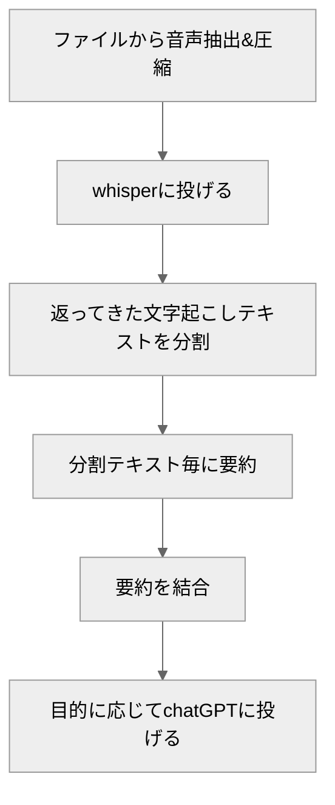

```mermaid
%%{init:{'theme':'neutral'}}%%
graph TD
    A[ファイルから音声抽出&圧縮]
    A --> B[whisperに投げる]
    B --> C[返ってきた文字起こしテキストを分割]
    C --> D[分割テキスト毎に要約]
    D --> E[要約を結合]
    E --> F[目的に応じてchatGPTに投げる]
```