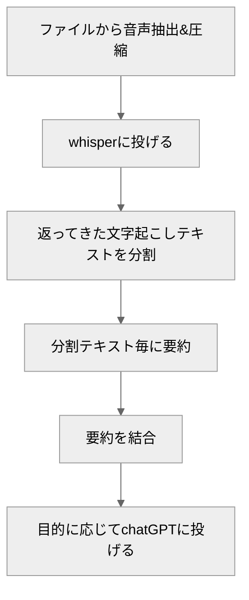

## はじめに
本記事では、議事録作成の自動化を目的としてOpenAIのChatGPTとWhisperのAPIを組み合わせたワークフローを紹介します。このワークフローでは、まず会議の録音データをWhisperで文字起こしし、その後、ChatGPTを用いて要約を行います。

使用したコードはこちらで共有しています：[GitHubリポジトリ](https://github.com/takumi5757/minutes-generator-local)

## ワークフロー

ワークフローの概要です。詳細は後述します。




## Whisper周りの工夫

### 25MBのファイル容量上限
Whisper APIは25MBのファイル容量上限があります。そのため容量の大きい動画であれば音声のみを抽出し、音声の圧縮をするなどの対応が必要があります。
では、25MBは具体的にどのくらいの録音時間に相当するのでしょうか？4G音声の電話のビットレート（12.65kbps）を基準にすると、およそ4.4時間の録音が可能です（[参考記事](https://www.itmedia.co.jp/mobile/articles/1406/05/news159.html)）。今回のデモでは、最大4時間の音声ファイルまでを入力の上限として、25MB以下に圧縮してWhisperに送信しています。

subprocessを使用して、ffmpegを呼び出して対応しました。
```python
# 動画から音声を抽出する
    def extract_audio_from_video(
        input_tempfile: tempfile.NamedTemporaryFile,
    ) -> tempfile.NamedTemporaryFile:
        # 音声を抽出するための一時ファイルを作成
        with tempfile.NamedTemporaryFile(
            delete=False, suffix=".mp3"
        ) as output_tempfile:
            subprocess.run(
                [
                    "ffmpeg",
                    "-y",
                    "-i",
                    input_tempfile.name,
                    "-q:a",
                    "0",
                    "-map",
                    "a",
                    output_tempfile.name,
                ]
            )
        os.remove(input_tempfile.name)
        return output_tempfile
```

```python
# 音声を圧縮する
    @classmethod
    def compress_audio(
        cls,
        input_file: tempfile.NamedTemporaryFile,
    ) -> tempfile.NamedTemporaryFile:
        logger.info("=== compress audio ===")

        # Check audio duration
        duration = cls.get_audio_duration(input_file.name)

        # Calculate bitrate based on audio duration
        bitrate = cls.calculate_bitrate(duration)
        logger.info(f"Target bitrate: {bitrate}")

        with tempfile.NamedTemporaryFile(
            delete=False, suffix=".mp3"
        ) as output_tempfile:
            subprocess.run(
                [
                    "ffmpeg",
                    "-y",
                    "-i",
                    input_file.name,
                    "-codec:a",
                    "mp3",
                    "-ar",
                    "16000",
                    "-ac",
                    "1",
                    "-b:a",
                    bitrate,
                    output_tempfile.name,
                ]
            )

        os.remove(input_file.name)
        logger.info(f"Compressed audio size:{os.path.getsize(output_tempfile.name)}")
        return output_tempfile
```

### 無音区間の扱い
無音区間を削除しないと、無音区間で以下のようなリピーティングが起きることがあります。
```
〜ということです。それで、それで、それで、それで、それで、それで、それで、それで、
```
以下のリポジトリを参考に、無音区間を削除する処理を実装しました。
https://github.com/snakers4/silero-vad


## ChatGPT周りの工夫

### max_token対応
ChatGPTには、一度に処理できるトークン数に制限があります。そのため、長文の要約には文章の分割が必要です。分割の方法として、「Map Reduce」、「Map Rerank」、「Refine」などがありますが、今回は「Map Reduce」を使用しました。これは、分割したテキストごとに個別の要約を生成し、それらを1つの要約に統合する手法です（[参考資料](https://python.langchain.com/docs/modules/chains/document/)）。

```python
    @classmethod
    def map_sammaries(cls, text: str):
        text_splitter = CharacterTextSplitter.from_tiktoken_encoder(
            separator=" ", chunk_size=cls.CHUNK_SIZE, chunk_overlap=cls.chunk_overlap
        )
        text_chunks = text_splitter.split_text(text)
        total_tokens = 0
        prompt_tokens = 0
        completion_tokens = 0
        costs = 0
        response_messages = []

        for chunk in text_chunks:
            logger.info(chunk)

            messages = [
                {
                    "role": "system",
                    "content": """
                        あなたは会議の議事録を作成するプロフェッショナルアシスタントです。
                        これから会議の文字起こししたテキストを分割して渡します。
                        テキストは話者分離をしていません。
                        この文章から重要な内容を抽出してください。
                        あなたの推察はせず、文章に明記されている内容をそのまま抽出してください。
                        抽出は箇条書きではなく、文章で行なってください。
                        """,
                },
                {"role": "user", "content": chunk},
            ]
            num_tokens = num_tokens_from_messages(messages, model=cls.MODEL)
            response = openai.ChatCompletion.create(
                model=cls.MODEL,
                messages=messages,
                temperature=0,
                max_tokens=min(
                    cls.MAX_TOKENS // len(text_chunks), cls.MAX_TOKENS - num_tokens
                ),
            )
            total_tokens += response["usage"]["total_tokens"]
            prompt_tokens += response["usage"]["prompt_tokens"]
            completion_tokens += response["usage"]["completion_tokens"]
            costs += (
                response["usage"]["prompt_tokens"] * cls.COST_DICT[cls.MODEL]["input"]
                + response["usage"]["completion_tokens"]
                * cls.COST_DICT[cls.MODEL]["output"]
            ) / 1000
            response_messages.append(response["choices"][0]["message"]["content"])
            logger.info(f"chat create: {response['choices'][0]['message']['content']}")
        return response_messages, costs
```

### 出力の構造化
function_callingで、pydanticのBaseModelのschemaを渡してあげることで出力の構造化ができます。

```python
# 出力のモデルの定義
class SimpleSummary(BaseModel):
    summary: str = Field(..., description="要約の内容を文章で書いたもの")
    summary_bullet: List[str] = Field(..., description="要点のリスト")
    decisions: List[str] = Field(..., description="タスク以外で決定された事項リスト")
    tasks: List[str] = Field(..., description="やるべきタスクのリスト")

~~~
    @classmethod
    def get_simple_summary(cls, doc_summaries: str):
        costs = 0

        template = """
        あなたは会議の議事録を作成するアシスタントです。
        これから会議の文字起こしの要点を抽出した文章を渡します。
        この会議の要約、要点のリスト、決定事項のリスト、タスクのリストを返してください。
        会議の要約は渡した文章の体裁を留める程度で漏れのない文章で書いてください。タスクのリストには今後やるべきタスクを書いてください。
        タスクのリストには既に完了したことについては記載しないように注意してください。
        決定事項のリストにはタスク以外で決定された事項を書いてください。

        以下は要約のセットである：
        {doc_summaries}"""

        prompt = PromptTemplate(template=template, input_variables=["doc_summaries"])
        messages = [
            {"role": "user", "content": prompt.format(doc_summaries=doc_summaries)},
        ]
        functions = [
            {
                "name": "get_simple_summary",
                "description": """会議の文字起こしの要点などを抽出した文章から会議の要約、会議の要点のリスト、
                    会議で決定された事項のリスト、タスクのリストを抽出するための処理です。""",
                "parameters": SimpleSummary.schema(),# 出力のモデルのスキーマを渡す
            }
        ]
        message_tokens = num_tokens_from_messages(messages, model=cls.MODEL)
        functions_tokens = num_tokens_from_functions(functions, model=cls.MODEL)
        logger.info(f"message_tokens: {message_tokens}")
        logger.info(f"functions_tokens: {functions_tokens}")
	
        response = openai.ChatCompletion.create(
            model=cls.MODEL,
            messages=messages,
            functions=functions,
            function_call={"name": "get_simple_summary"},
            temperature=0,
            max_tokens=max(
                cls.MAX_TOKENS - message_tokens - functions_tokens, 0
            ),  # tokenをカウントして補正する
        )

        costs += (
            response["usage"]["prompt_tokens"] * cls.COST_DICT[cls.MODEL]["input"]
            + response["usage"]["completion_tokens"]
            * cls.COST_DICT[cls.MODEL]["output"]
        ) / 1000

        return response, costs
	
~~~
# 出力の取り出し
response_message = response["choices"][0]["message"]
# Step 2: check if GPT wanted to call a function
if response_message.get("function_call"):
# Step 3: call the function
# Note: the JSON response may not always be valid; be sure to handle errors
try:
    function_args = json.loads(response_message["function_call"]["arguments"])
except Exception as e:
    logger.error(f"Error parsing function arguments: {e}")
    function_args = None
simple_summary = function_args
else:
simple_summary = None
```
これで、simple_summaryに出力モデルのフィールドをキーにしたdictが格納されます。

## コスト（2024/01/14時点）

### whisper

$0.006 / 1分

### gpt-4-turbo

| Model              | Input             | Output            |
| ------------------ | ----------------- | ----------------- |
| gpt-4-1106-preview | $0.01 / 1K tokens | $0.03 / 1K tokens |

### GPT-4

| Model       | Input             | Output            |
| ----------- | ----------------- | ----------------- |
| 8K context  | $0.03 / 1K tokens | $0.06 / 1K tokens |
| 32K context | $0.06 / 1K tokens | $0.12 / 1K tokens |

日本語だと1~0.9文字/token程度

### ****GPT-3.5 Turbo****

| Model       | Input               | Output              |
| ----------- | ------------------- | ------------------- |
| 16K context | $0.0010 / 1K tokens | $0.0020 / 1K tokens |

gpt-4-turbo安いですね、今回の試作時にはまだ無かったモデルなので試せてはないです。

ちなみに日本語では、約1～0.9文字が1トークンに相当します。

30分くらいの対談動画だと、gpt-4(8k)で要約コストは
Whisper cost: 0.16 $
GPT cost: 0.57 $
Total cost: 0.73 $
で1ドル以下です、安いですね。

## 課題と改善点

### Whisperの課題

- 人名の誤変換や表記の揺れが生じることがあります
  - 一応Whisperにプロンプトを入力することで対策があります。
- 話者の区別
  - WhisperとPyannoteを使用した話者分離方法や、Azure Open AI Serviceでの対応策があります。

[WhisperとPyannoteを用いた話者分離と音声認識 | Hakky Handbook](https://book.st-hakky.com/docs/whisper-pyannote-diarization/)

@[tweet](https://twitter.com/daiki15036604/status/1702828819558912132)


### ChatGPTの課題

- 「行った」、「これから行う」といった行動の区別の誤り
- 雑談と業務内容の区別が曖昧になることがある

## まとめ
議事録の生成を自動化するためにOpenAIのChatGPTとWhisperのAPIを組み合わせました。主なフローは、会議の録音データをWhisperで文字起こしし、その後ChatGPTで要約するというものです。長時間の会議音声などでも数分で議事録ができる点が魅力的です。

また、今回は要約を目的として扱ってきましたが、要約以外のタスクでも活用できる範囲はとても広いと考えています。
今後、得られた知見を基に、さまざまな用途への適用も模索していく予定です。

※後学のため、誤りを見つけた場合はコメント欄などでお知らせいただけると有難いです。