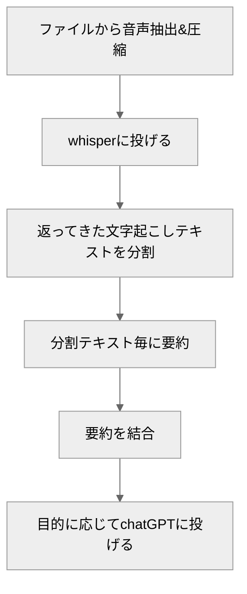

議事録の生成を自動化するため、OpenAIのChatGPTとWhisperのAPIを組み合わせることにしました。このアプローチでは、まず会議の録音データをWhisperで文字起こしし、その後、ChatGPTを用いて要約を行います。

使用したコードはこちらで共有しています：[GitHubリポジトリ](https://github.com/takumi5757/minutes-generator-local)

## 実装のワークフロー

ワークフローの概要です。詳細は後述します。




### Whisperの使用

Whisper APIは25MBのファイル容量制限があります。そのため動画であれば音声のみを抽出し、音声の圧縮をする必要があります。
では、25MBは具体的にどのくらいの録音時間に相当するのでしょうか？4G音声の電話のビットレート（12.65kbps）を基準にすると、およそ4.4時間の録音が可能です（[参考記事](https://www.itmedia.co.jp/mobile/articles/1406/05/news159.html)）。今回のデモでは、最大4時間の音声ファイルまでを入力の上限として、25MB以下に圧縮してWhisperに送信しています。

subprocessを使用して、ffmpegを呼び出して対応しました。
```python
# 動画から音声を抽出する
    def extract_audio_from_video(
        input_tempfile: tempfile.NamedTemporaryFile,
    ) -> tempfile.NamedTemporaryFile:
        # 音声を抽出するための一時ファイルを作成
        with tempfile.NamedTemporaryFile(
            delete=False, suffix=".mp3"
        ) as output_tempfile:
            subprocess.run(
                [
                    "ffmpeg",
                    "-y",
                    "-i",
                    input_tempfile.name,
                    "-q:a",
                    "0",
                    "-map",
                    "a",
                    output_tempfile.name,
                ]
            )
        os.remove(input_tempfile.name)
        return output_tempfile
```

```python
# 音声を圧縮する
    @classmethod
    def compress_audio(
        cls,
        input_file: tempfile.NamedTemporaryFile,
    ) -> tempfile.NamedTemporaryFile:
        logger.info("=== compress audio ===")

        # Check audio duration
        duration = cls.get_audio_duration(input_file.name)

        # Calculate bitrate based on audio duration
        bitrate = cls.calculate_bitrate(duration)
        logger.info(f"Target bitrate: {bitrate}")

        with tempfile.NamedTemporaryFile(
            delete=False, suffix=".mp3"
        ) as output_tempfile:
            subprocess.run(
                [
                    "ffmpeg",
                    "-y",
                    "-i",
                    input_file.name,
                    "-codec:a",
                    "mp3",
                    "-ar",
                    "16000",
                    "-ac",
                    "1",
                    "-b:a",
                    bitrate,
                    output_tempfile.name,
                ]
            )

        os.remove(input_file.name)
        logger.info(f"Compressed audio size:{os.path.getsize(output_tempfile.name)}")
        return output_tempfile
```


### ChatGPTの適用

ChatGPTには、一度に処理できるトークン数に制限があります。そのため、長文の要約には文章の分割が必要です。分割の方法として、「Map Reduce」、「Map Rerank」、「Refine」の3種類があり、今回は「Map Reduce」を使用しました。これは、分割したテキストごとに個別の要約を生成し、それらを1つの要約に統合する手法です（[参考資料](https://python.langchain.com/docs/modules/chains/document/)）。

```python
    @classmethod
    def map_sammaries(cls, text: str):
        text_splitter = CharacterTextSplitter.from_tiktoken_encoder(
            separator=" ", chunk_size=cls.CHUNK_SIZE, chunk_overlap=cls.chunk_overlap
        )
        text_chunks = text_splitter.split_text(text)
        total_tokens = 0
        prompt_tokens = 0
        completion_tokens = 0
        costs = 0
        response_messages = []

        for chunk in text_chunks:
            logger.info(chunk)

            messages = [
                {
                    "role": "system",
                    "content": """
                        あなたは会議の議事録を作成するプロフェッショナルアシスタントです。
                        これから会議の文字起こししたテキストを分割して渡します。
                        テキストは話者分離をしていません。
                        この文章から重要な内容を抽出してください。
                        あなたの推察はせず、文章に明記されている内容をそのまま抽出してください。
                        抽出は箇条書きではなく、文章で行なってください。
                        """,
                },
                {"role": "user", "content": chunk},
            ]
            num_tokens = num_tokens_from_messages(messages, model=cls.MODEL)
            response = openai.ChatCompletion.create(
                model=cls.MODEL,
                messages=messages,
                temperature=0,
                max_tokens=min(
                    cls.MAX_TOKENS // len(text_chunks), cls.MAX_TOKENS - num_tokens
                ),
            )
            total_tokens += response["usage"]["total_tokens"]
            prompt_tokens += response["usage"]["prompt_tokens"]
            completion_tokens += response["usage"]["completion_tokens"]
            costs += (
                response["usage"]["prompt_tokens"] * cls.COST_DICT[cls.MODEL]["input"]
                + response["usage"]["completion_tokens"]
                * cls.COST_DICT[cls.MODEL]["output"]
            ) / 1000
            response_messages.append(response["choices"][0]["message"]["content"])
            logger.info(f"chat create: {response['choices'][0]['message']['content']}")
        return response_messages, costs
```

### 無音区間の扱い
無音区間を削除しないと、Whisperの処理に影響が出ることがあります（リピーティング問題）。
以下のリポジトリを参考に、無音区間を削除する処理を実装しました。
https://github.com/snakers4/silero-vad


## コスト

### whisper

$0.006 / 1分

### gpt-4-turbo

| Model              | Input             | Output            |
| ------------------ | ----------------- | ----------------- |
| gpt-4-1106-preview | $0.03 / 1K tokens | $0.06 / 1K tokens |

### GPT-4

| Model       | Input             | Output            |
| ----------- | ----------------- | ----------------- |
| 8K context  | $0.03 / 1K tokens | $0.06 / 1K tokens |
| 32K context | $0.06 / 1K tokens | $0.12 / 1K tokens |

日本語だと1~0.9文字/token程度

### ****GPT-3.5 Turbo****

| Model       | Input               | Output              |
| ----------- | ------------------- | ------------------- |
| 16K context | $0.0010 / 1K tokens | $0.0020 / 1K tokens |

gpt-4-turbo安いですね、今回の試作時にはまだ無かったモデルなので試せてはないです。

ちなみに日本語では、約1～0.9文字が1トークンに相当します。

30分の対談動画だと、gpt-4(8k)で要約コストは
Whisper cost: 0.16 $
GPT cost: 0.57 $
Total cost: 0.73 $
で1ドル以下です、安いですね。

## 課題と改善点

### Whisperの課題

- 人名の誤変換や表記の揺れが生じることがあります
  - 一応Whisperにプロンプトを入力することで対策があります。
- 話者の区別
  - WhisperとPyannoteを使用した話者分離方法や、Azure Open AI Serviceでの対応策があります。

[WhisperとPyannoteを用いた話者分離と音声認識 | Hakky Handbook](https://book.st-hakky.com/docs/whisper-pyannote-diarization/)

@[tweet](https://twitter.com/daiki15036604/status/1702828819558912132)


### ChatGPTの課題

- 「行った」、「これから行う」といった行動の区別の誤り
- 雑談と業務内容の区別が曖昧になることがある

## まとめ
議事録の生成を自動化するためにOpenAIのChatGPTとWhisperのAPIを組み合わせました。主なフローは、会議の録音データをWhisperで文字起こしし、その後ChatGPTで要約するというものです。長時間の会議音声などでも数分で議事録ができる点が魅力的です。

また、今回は要約を目的として扱ってきましたが、要約以外のタスクでも活用できる範囲はとても広いと考えています。
得られた知見を活用しながら、新たな適用例も考えていきたいと思います。